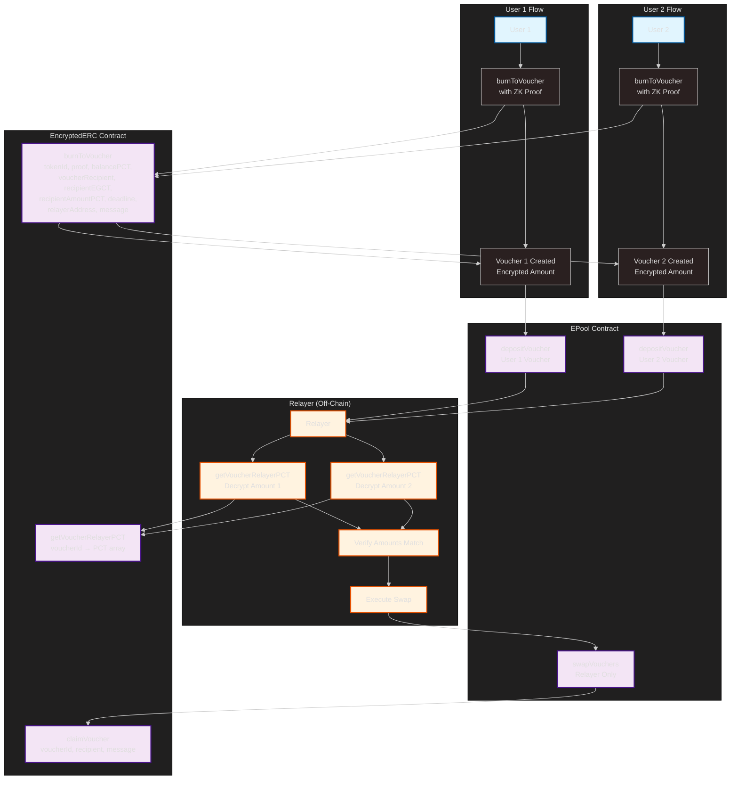

<div  align="center">


</div>

[](https://github.com/lunarys-protocol/lunarys/actions/workflows/ci.yml)
[](https://github.com/lunarys-protocol/lunarys/tree/main/audit)
[](https://docs.lunarys.io)

# Lunarys Protocol - EncryptedERC

A privacy-preserving token swapping system built on EVM-compatible blockchains using zero-knowledge proofs and elliptic curve cryptography.

The Encrypted ERC-20 (eERC) standard, avalabs and extended by Lunarys, enables secure and confidential token transfers on EVM-compatible blockchains. Leveraging zk-SNARKs and partially homomorphic encryption, the eERC protocol offers robust privacy without requiring protocol-level modifications or off-chain intermediaries.

## 🆕 New Features

- **🔄 Privacy Pools**: Anonymous token swapping through encrypted vouchers
- **👥 Relayer System**: Off-chain decryption for seamless swaps
- **🎫 Encrypted Vouchers**: Burn tokens to create privacy-preserving vouchers
- **🏦 Liquidity Pools**: Deposit and swap encrypted tokens privately

## Key features

- **Confidential Transactions**: User balances and transaction amounts remain completely hidden, ensuring financial confidentiality.

- **Large Integers**: Efficiently handles large token amounts up to 251 bits (2^251), providing greater flexibility.

- **Client-Side Operations**: Users retain control, performing encryption, decryption, and zk-proof generation directly on their own devices.

- **Fully On-chain Nature**: Operates entirely on-chain without the need for relayers or off-chain actors.

- **Built-in Compliance**: Supports external and rotatable auditors, ensuring regulatory compliance.

- **Dual-Mode Operation**: Supports both creating new private tokens and converting existing ERC-20 tokens their private versions.

- **Zero-Knowledge Proofs**: Uses efficient zk-SNARKs to validate statements without revealing sensitive information.

- **Chain Agnostic**: Can be deployed on any EVM-compatible blockchain.

- **(NEW) Encrypted Metadata**: Allows users to send arbitrary-length encrypted metadata along with transactions.

## 🏗️ Lunarys High-Level Architecture

```
┌─────────────────────────────────────────────────────────────────────────────────────────────────────┐
│                                       LUNARYS ECOSYSTEM                                              │
└─────────────────────────────────────────────────────────────────────────────────────────────────────┘

┌─────────────────────┐    ┌─────────────────────┐    ┌─────────────────────┐    ┌─────────────────────┐
│        USER         │    │   PRIVACY POOL      │    │   ENCRYPTED ERC     │    │      E-POOL        │
│                     │    │   (ERC20)           │    │   (eERC)            │    │   (VOUCHERS)       │
│  ┌─────────────┐    │    │  ┌─────────────┐    │    │  ┌─────────────┐    │    │  ┌─────────────┐    │
│  │ ERC20 TOKENS│    │    │  │DEPOSITS     │    │    │  │TRANSFERS    │    │    │  │DEPOSITS     │    │
│  │             │    │    │  │(COMMITMENTS)│    │    │  │(ENCRYPTED)  │    │    │  │(VOUCHERS)   │    │
│  └─────────────┘    │    │  └─────────────┘    │    │  └─────────────┘    │    │  └─────────────┘    │
└─────────────────────┘    └─────────────────────┘    └─────────────────────┘    └─────────────────────┘
           │                           │                           │                           │
           │                           │                           │                           │
           └───────────────────────────┼───────────────────────────┼───────────────────────────┘
                                       │                           │
                                       │                           │
                            ┌─────────────────────┐               │
                            │    RELAYER SYSTEM   │               │
                            │                     │               │
                            │  ┌─────────────┐    │               │
                            │  │EXECUTES     │    │               │
                            │  │SWAPS        │    │               │
                            │  │WITHDRAWALS  │    │               │
                            │  └─────────────┘    │               │
                            └─────────────────────┘               │
                                       │                           │
                                       │                           │
                                       └───────────────────────────┘
                                                   │
                                                   │
                                        ┌─────────────────────┐
                                        │   AUDITOR SYSTEM    │
                                        │                     │
                                        │  ┌─────────────┐    │
                                        │  │VERIFIES     │    │
                                        │  │BALANCES     │    │
                                        │  │COMPLIANCE   │    │
                                        │  └─────────────┘    │
                                        └─────────────────────┘

┌─────────────────────────────────────────────────────────────────────────────────────────────────────┐
│                                   COMPLETE LUNARYS FLOW                                              │
├─────────────────────────────────────────────────────────────────────────────────────────────────────┤
│                                                                                                      │
│  1. DEPOSIT ERC20 → 2. MINT EERC → 3. BURN TO VOUCHER → 4. DEPOSIT VOUCHER →                        │
│     5. RELAYER EXECUTES SWAP → 6. CLAIM VOUCHER → 7. WITHDRAW ERC20 (NEW ADDRESS)                   │
│                                                                                                      │
│  ┌─────────────┐   ┌─────────────┐   ┌─────────────┐   ┌─────────────┐   ┌─────────────┐             │
│  │  PRIVACY    │ → │ ENCRYPTED   │ → │   VOUCHER   │ → │   E-POOL    │ → │   RELAYER   │             │
│  │   POOL      │   │    ERC      │   │  (BURNTO)   │   │  (DEPOSIT)  │   │   (SWAP)    │             │
│  └─────────────┘   └─────────────┘   └─────────────┘   └─────────────┘   └─────────────┘             │
│                                                                                                      │
└─────────────────────────────────────────────────────────────────────────────────────────────────────┘
```

### System Architecture Summary


**Architecture Layers:**

- **User Layer** → ERC20 holders interact with the system
- **Privacy Layer** → Core contracts (Privacy Pool, Encrypted ERC, E-Pool)
- **Execution Layer** → Relayer handles off-chain operations
- **Security Layer** → ZK proofs and auditor compliance verification

````

## Architecture

The eERC protocol consists of several key components:

### Core Contracts

- **EncryptedERC** ([contracts/EncryptedERC.sol](contracts/EncryptedERC.sol)): The main contract that implements the privacy-preserving ERC-20 functionality. It handles:

  - Private token operations (mint, burn, transfer)
  - Privacy-preserving balance management
  - Integration with other core components

- **Registrar**: Manages user registration and public key association.

  - Handles user registration
  - Stores public keys
  - Validates user identities
  - Manages registration proofs

- **EncryptedUserBalances**: Handles encrypted balance storage and updates.

  - Stores encrypted balances
  - Manages balance updates in encrypted manner
  - Ensures balance privacy
  - Handles encrypted balance verification

- **TokenTracker**: Manages token registration and tracking.

  - Tracks registered tokens
  - Manages token metadata
  - Handles token blacklisting

- **AuditorManager**: Provides auditor-related functionality for compliance.
  - Manages auditor permissions
  - Stores auditor address with it's public key

### Cryptographic Components

- **BabyJubJub**: Library for elliptic curve operations on the BabyJubJub curve.

- **Zero-Knowledge Circuits**: Circom-based circuits for proof generation and verification.

  - **Registration Circuit**: Validates user registration
  - **Mint Circuit**: Verifies minting operations
  - **Transfer Circuit**: Validates private transfers
  - **Withdraw Circuit**: Verifies withdrawal operations
  - **🆕 BurnToVoucher Circuit**: Validates voucher creation with relayer encryption

### 🆕 Privacy Pools System

The new EPool contract enables privacy-preserving token swaps through encrypted vouchers:

#### Core Components

- **EPool Contract**: Manages voucher deposits and executes swaps
- **Encrypted Vouchers**: Burn tokens to create privacy-preserving vouchers
- **Relayer System**: Off-chain decryption for seamless swaps
- **Cross-Token Swaps**: Swap between different encrypted token types

#### Key Functions

**Burn to Voucher** (`burnToVoucher`):

```solidity
function burnToVoucher(
    uint256 tokenId,
    bytes calldata proof,
    bytes calldata balancePCT,
    address voucherRecipient,
    bytes calldata recipientEGCT,
    bytes calldata recipientAmountPCT,
    uint256 deadline,
    address relayerAddress,
    bytes calldata message
) external
````

- Burns encrypted tokens and creates a voucher
- Includes relayer PCT for off-chain decryption
- Voucher can be deposited to EPool for swapping

**Deposit Voucher** (`depositVoucher`):

```solidity
function depositVoucher(
    bytes32 voucherId,
    address tokenAddress,
    uint256 deadline,
    bytes calldata message
) external payable
```

- Deposits encrypted voucher to pool
- Requires small fee for pool operations
- Verifies voucher ownership and validity

**Swap Vouchers** (`swapVouchers`):

```solidity
function swapVouchers(
    bytes32 voucherIdA,
    bytes32 voucherIdB,
    uint256 deadline
) external onlyRelayer
```

- Executes swap between two vouchers
- Only authorized relayer can call
- Transfers tokens between users privately

### Operation Modes

1. **Standalone Mode**:

   - Creates entirely new private ERC-20 (eERC) tokens
   - Relies on minting and burning to manage token supply
   - Keeps total supply private all the time, offering better privacy compared to converter mode

2. **Converter Mode**:

   - Wraps existing ERC20 tokens to eERC tokens
   - Relies on deposits and withdrawals to manage token supply
   - Maintains compatibility with original tokens

3. **🆕 Pool Mode**:
   - Enables privacy-preserving token swaps
   - Uses encrypted vouchers for anonymous trading
   - Relayer decrypts amounts off-chain
   - Supports cross-token swaps

## File structure

- [contracts](#contracts) Smart contract source files

  - `EncryptedERC.sol` - Main contract implementation
  - `EPool.sol` - 🆕 Privacy pool for encrypted token swaps
  - `EncryptedPoolBalance.sol` - 🆕 Pool balance management
  - `PrivateLiquidityPool.sol` - 🆕 Private liquidity pool implementation

  - `Registrar.sol` - User registration management

  - `EncryptedUserBalances.sol` - Encrypted balance handling

  - `tokens/TokenTracker.sol` - Token registration and tracking

  - `auditor/AuditorManager.sol` - Auditor functionality

  - `libraries/BabyJubJub.sol` - Cryptographic operations

  - `types/Types.sol` - Data structures and types

  - `interfaces/` - Contract interfaces

  - `verifiers/` - Zero-knowledge proof verifiers
  - `verifiers/BurnToVoucherVerifier.sol` - 🆕 Voucher burning verifier

- [scripts](#scripts) Utility and deployment scripts

- [src](#src) Encryption utilities for TypeScript

- [tests](#tests) Test scripts and helpers

  - `EncryptedERC-Standalone.ts` - Core token functionality tests
  - `EncryptedMetadata.ts` - Metadata encryption tests
  - `EPool-Full.ts` - 🆕 Complete privacy pool workflow tests

- [circom](#circom) Zero-knowledge proof circuits

## Getting Started

### Prerequisites

You need following dependencies for setup:

- `NodeJS >= v22.x`

- `Circom >= 2.1.9`

### Installation

1. Clone the repo

```sh
git clone https://github.com/ava-labs/EncryptedERC.git
```

2. Install NPM packages

```sh
npm install
```

3. Compile the contracts

```sh
npx hardhat compile
```

4. Compile Circuits

```sh
npx hardhat zkit make --force # compiles circuits
npx hardhat zkit verifiers    # generates verifiers
```

## Deployment (Local)

### Standalone

The Standalone version lets users create entirely new private ERC-20 tokens with built-in privacy, supporting confidential minting and burning.

1. Start the local node

```sh
npx hardhat node
```

2. Deploy the contract

```sh
npx hardhat run scripts/deploy-standalone.ts --network localhost
```

Refer to the [scripts/deploy-standalone.ts](scripts/deploy-standalone.ts) script for deployment examples.

### Converter

The Converter version adds privacy features to existing ERC-20 tokens, enabling users to convert standard ERC-20 tokens to private ones and switch between public and private states through deposit and withdrawal functions.

1. Start the local node

```sh
npx hardhat node
```

2. Deploy the contract

```sh
npx hardhat run scripts/deploy-converter.ts --network localhost
```

Refer to the [scripts/deploy-converter.ts](scripts/deploy-converter.ts) script for deployment examples.

### 🆕 Deploying Privacy Pools

1. **Deploy EncryptedERC tokens**

```bash
npx hardhat run scripts/deploy-standalone.ts --network localhost
```

2. **Deploy EPool contract**

```typescript
// Example deployment script
const EPool = await ethers.getContractFactory("EPool");
const epool = await EPool.deploy(tokenA.address, tokenB.address, 0, 1);
```

3. **Setup Relayer**

```typescript
// Relayer needs to be registered and authorized
await epool.setRelayer(relayerAddress);
```

## 🏗️ Architecture Overview - Privacy Pools Flow



### 🔄 Complete Privacy Flow

1. **User 1** calls `burnToVoucher()` with ZK proof → Creates encrypted voucher
2. **User 2** calls `burnToVoucher()` with ZK proof → Creates encrypted voucher
3. **Both users** call `depositVoucher()` on EPool contract
4. **Relayer** calls `getVoucherRelayerPCT()` to get encrypted PCTs
5. **Relayer** decrypts amounts off-chain using private key
6. **Relayer** verifies amounts match and calls `swapVouchers()`
7. **EPool** executes swap and calls `claimVoucher()` for both users

### 🔑 Key Functions Used

**EncryptedERC Contract:**

- `burnToVoucher(tokenId, proof, balancePCT, voucherRecipient, recipientEGCT, recipientAmountPCT, deadline, relayerAddress, message)`
- `getVoucherRelayerPCT(voucherId)` → returns encrypted PCT array
- `claimVoucher(voucherId, recipient, message)` → transfers tokens

**EPool Contract:**

- `depositVoucher(voucherId, tokenAddress, deadline, message)` → payable
- `swapVouchers(voucherIdA, voucherIdB, deadline)` → onlyRelayer
- `getPoolInfo()` → returns token counts and fees

**Relayer Operations (Off-Chain):**

- Decrypt PCT using `decryptPCT(relayerPrivateKey, pctArray)`
- Verify amounts match before executing swap
- Call pool functions with decrypted information

## Run Tests/Coverage

Contract tests:

```sh
npx hardhat test
```

Coverage report:

```sh
npx hardhat coverage
```

### 🆕 Testing Privacy Pools

Run the complete privacy pool test suite:

```sh
npx hardhat test test/EPool-Full.ts
```

This test suite covers:

- ✅ **Voucher Creation**: Encrypted voucher generation
- ✅ **Deposit Operations**: Pool voucher deposits
- ✅ **Swap Execution**: Relayer swap operations
- ✅ **Privacy Verification**: Amount hiding validation
- ✅ **Security Testing**: Access control verification

## 🏊 Using Privacy Pools

### Complete Workflow Example

```typescript
import { ethers } from "hardhat";
import { generateKeys, encryptMessage } from "./src";

async function privacySwap() {
  // 1. Setup users and tokens
  const [user1, user2, relayer] = await ethers.getSigners();

  // Deploy tokens
  const TokenA = await ethers.getContractFactory("EncryptedERC");
  const TokenB = await ethers.getContractFactory("EncryptedERC");
  const tokenA = await TokenA.deploy();
  const tokenB = await TokenB.deploy();

  // Deploy pool
  const EPool = await ethers.getContractFactory("EPool");
  const epool = await EPool.deploy(tokenA.address, tokenB.address, 0, 1);

  // 2. User registration
  const userKeys = generateKeys();
  await tokenA.register(userKeys.publicKey);
  await tokenB.register(userKeys.publicKey);

  // 3. Mint tokens
  const mintProof = await generateMintProof(1000, userKeys);
  await tokenA.privateMint(user1.address, mintProof);

  // 4. Create voucher for pool
  const voucherProof = await generateBurnProof(
    userBalance,
    burnAmount,
    epool.address, // Send to pool
    relayer.address
  );

  await tokenA.burnToVoucher(
    0, // tokenId
    voucherProof,
    balancePCT,
    epool.address, // voucher recipient
    recipientEGCT,
    recipientAmountPCT,
    deadline,
    relayer.address,
    encryptedMessage
  );

  // 5. Deposit to pool
  await epool.depositVoucher(
    voucherId,
    tokenA.address,
    deadline,
    encryptedMessage,
    { value: ethers.parseEther("0.01") } // fee
  );

  // 6. Relayer executes swap
  await epool.connect(relayer).swapVouchers(voucherIdA, voucherIdB, deadline);
}
```

### Relayer Operations

```typescript
// Relayer decrypts amounts off-chain
const amountA = decryptPCT(relayerPrivateKey, voucherA.relayerPCT);
const amountB = decryptPCT(relayerPrivateKey, voucherB.relayerPCT);

// Verify amounts match before executing swap
if (amountA === amountB) {
  await pool.swapVouchers(voucherIdA, voucherIdB, deadline);
}
```

## 📊 Efficiency Overview

### ⛽ Avg. On-Chain Gas Costs (EVM Blockchains)

```sh
······················································································································································································
|  Solidity and Network Configuration                                                                                                                                                │
·································································································|·················|···············|·················|································
|  Solidity: 0.8.27                                                                              ·  Optim: true    ·  Runs: 200    ·  viaIR: false   ·     Block: 30,000,000 gas     │
·································································································|·················|···············|·················|································
|  Network: AVALANCHE                                                                            ·  L1: 0.14345 gwei               ·                 ·        16.36 usd/avax         │
·································································································|·················|···············|·················|················|···············
|  Contracts / Methods                                                                           ·  Min            ·  Max          ·  Avg            ·    calls       ·  usd (avg)   │
·································································································|·················|···············|·················|················|···············
|  EncryptedERC                                                                                  ·                                                                                   │
·································································································|·················|···············|·················|················|···············
|      deposit(uint256,address,uint256[7])                                                       ·         71,680  ·      841,771  ·        564,892  ·            16  ·           △  │
·································································································|·················|···············|·················|················|···············
|      privateBurn(((uint256[2],uint256[2][2],uint256[2]),uint256[32]),uint256[7])               ·        890,507  ·    1,227,920  ·      1,028,678  ·             4  ·           △  │
·································································································|·················|···············|·················|················|···············
|      privateMint(address,((uint256[2],uint256[2][2],uint256[2]),uint256[24]))                  ·        712,316  ·      760,624  ·        722,016  ·            10  ·           △  │
·································································································|·················|···············|·················|················|···············
|      setAuditorPublicKey(address)                                                              ·              -  ·            -  ·        103,851  ·             4  ·           △  │
·································································································|·················|···············|·················|················|···············
|      setTokenBlacklist(address,bool)                                                           ·              -  ·            -  ·         46,443  ·             1  ·           △  │
·································································································|·················|···············|·················|················|···············
|      transfer(address,uint256,((uint256[2],uint256[2][2],uint256[2]),uint256[32]),uint256[7])  ·        947,295  ·      947,331  ·        947,313  ·             4  ·           △  │
·································································································|·················|···············|·················|················|···············
|      withdraw(uint256,((uint256[2],uint256[2][2],uint256[2]),uint256[16]),uint256[7])          ·        775,186  ·      828,341  ·        796,263  ·             6  ·           △  │
·································································································|·················|···············|·················|················|···············
|  Registrar                                                                                     ·                                                                                   │
·································································································|·················|···············|·················|················|···············
|      register(((uint256[2],uint256[2][2],uint256[2]),uint256[5]))                              ·        322,114  ·      322,150  ·        322,143  ·            20  ·           △  │
·································································································|·················|···············|·················|················|···············
|  Deployments                                                                                                     ·                                 ·  % of limit    ·              │
·································································································|·················|···············|·················|················|···············
|  BabyJubJub                                                                                    ·              -  ·            -  ·        447,616  ·         1.5 %  ·           △  │
·································································································|·················|···············|·················|················|···············
|  EncryptedERC                                                                                  ·      3,704,671  ·    3,729,773  ·      3,717,222  ·        12.4 %  ·        0.01  │
·································································································|·················|···············|·················|················|···············
|  MintCircuitGroth16Verifier                                                                    ·              -  ·            -  ·      1,690,470  ·         5.6 %  ·           △  │
·································································································|·················|···············|·················|················|···············
|  Registrar                                                                                     ·              -  ·            -  ·        508,067  ·         1.7 %  ·           △  │
·································································································|·················|···············|·················|················|···············
|  RegistrationCircuitGroth16Verifier                                                            ·              -  ·            -  ·        810,848  ·         2.7 %  ·           △  │
·································································································|·················|···············|·················|················|···············
|  TransferCircuitGroth16Verifier                                                                ·              -  ·            -  ·      2,052,092  ·         6.8 %  ·           △  │
·································································································|·················|···············|·················|················|···············
|  WithdrawCircuitGroth16Verifier                                                                ·              -  ·            -  ·      1,319,158  ·         4.4 %  ·           △  │
·································································································|·················|···············|·················|················|···············
|  Key                                                                                                                                                                               │
······················································································································································································
|  △  Cost was non-zero but below the precision setting for the currency display                                                                                                     │
······················································································································································································
```

## Security Audits

1. **Circom Audit**

   - Date: March 2025
   - Scope: Circom circuits for various zero-knowledge proofs
   - Report: [avacloud-eerc-circom-audit.pdf](audit/avacloud-eerc-circom-audit.pdf)

2. **Gnark Audit**

   - Date: March 2025
   - Scope: Core protocol and Gnark circuits for zero-knowledge proofs
   - Report: [avacloud-eerc-audit.pdf](audit/avacloud-eerc-audit.pdf)

3. **🆕 Privacy Pools Audit**
   - Date: Current
   - Scope: EPool contract, BurnToVoucher circuit, and relayer system
   - Status: In Progress

## Security Considerations

- **Auditor Integration**: The protocol includes built-in auditor functionality for compliance.

- **Blacklisting**: Supports optionalblacklisting for security purposes.

### 🆕 Privacy Pools Security

- **Relayer Trust**: Relayers can decrypt voucher amounts off-chain
- **Amount Matching**: Relayers verify amounts match before executing swaps
- **Fee Mechanism**: Small fees prevent spam attacks on pool deposits
- **Voucher Expiration**: Deadlines prevent long-term voucher accumulation

### Notes

For production deployments, set `isProd` to `true` in the deployment scripts to use the production verifiers. These verifiers use secure trusted setups from the [zkevm](https://github.com/iden3/snarkjs?tab=readme-ov-file#7-prepare-phase-2).

**🆕 Pool Mode**: When using privacy pools, ensure relayers are properly authorized and monitored. The relayer system maintains privacy while enabling efficient token swaps.

Corresponding `zkey` and `verification_key.json` files are present in the `circuits/build` directory. After compiling circuits present in the `circuits` folder, and downloading the proper `.ptau` files, these can be verified using the `snarkjs` tool with the following command:

```sh
snarkjs zkey verify <circuit_name>.r1cs powersOfTau28_hez_final_<Size>.ptau <circuit_name>.zkey
```

- For transfer/mint circuit => `powersOfTau28_hez_final_15.ptau`
- For withdraw circuit => `powersOfTau28_hez_final_14.ptau`
- For registration circuit => `powersOfTau28_hez_final_11.ptau`
- **🆕 For BurnToVoucher circuit** => `powersOfTau28_hez_final_15.ptau`

## 🆕 What's New - Privacy Pools

### Core Features Added

- **🔒 Encrypted Vouchers**: `burnToVoucher` function creates privacy-preserving vouchers
- **🏦 EPool Contract**: Decentralized liquidity pool for encrypted token swaps
- **👥 Relayer System**: Off-chain decryption enables seamless swaps
- **🎫 Cross-Token Swaps**: Swap between different encrypted token types
- **⚡ BurnToVoucher Circuit**: New ZK circuit for voucher creation validation

### Key Improvements

- **Privacy-First**: Amounts never exposed on-chain during swaps
- **Decentralized**: No centralized intermediaries required
- **Auditable**: Maintains compliance through auditor system
- **Efficient**: ZK-proofs enable instant verification
- **Flexible**: Supports multiple token types and swap scenarios

### Architecture Evolution

The system now supports three operation modes:

1. **Standalone Mode**: Private token creation and management
2. **Converter Mode**: Wrap existing ERC-20 tokens
3. **🆕 Pool Mode**: Privacy-preserving token swaps via encrypted vouchers

### Use Cases

- **DEX Integration**: Private token swaps on decentralized exchanges
- **Privacy Trading**: Anonymous trading without revealing amounts
- **Compliance**: Regulated trading with privacy guarantees

## License

This project is licensed under the Ecosystem License - see the LICENSE file for details.
